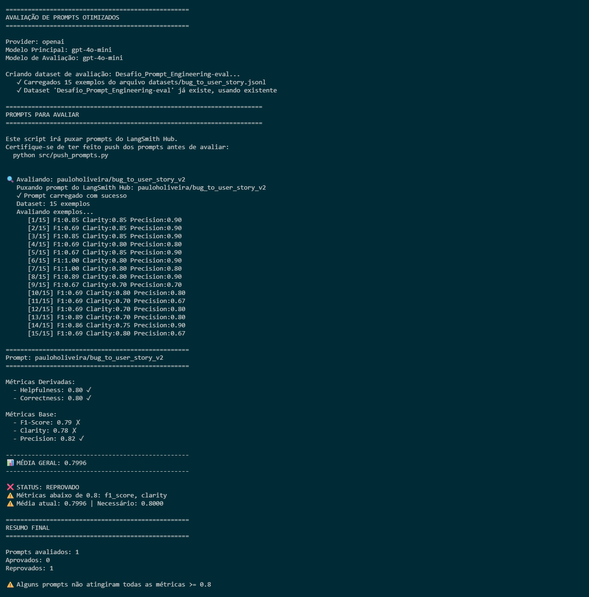
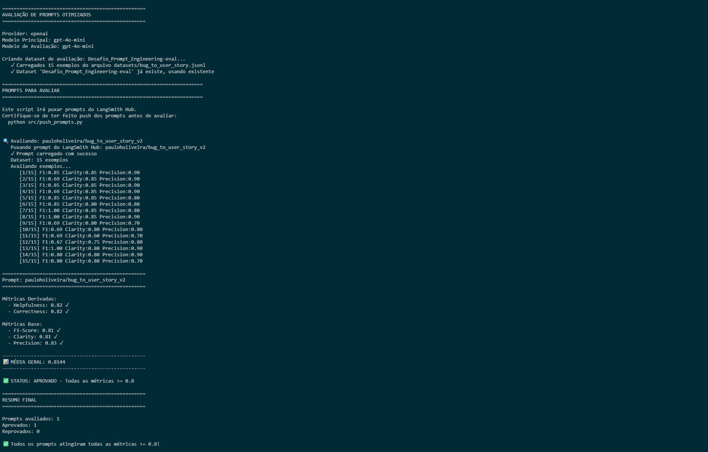
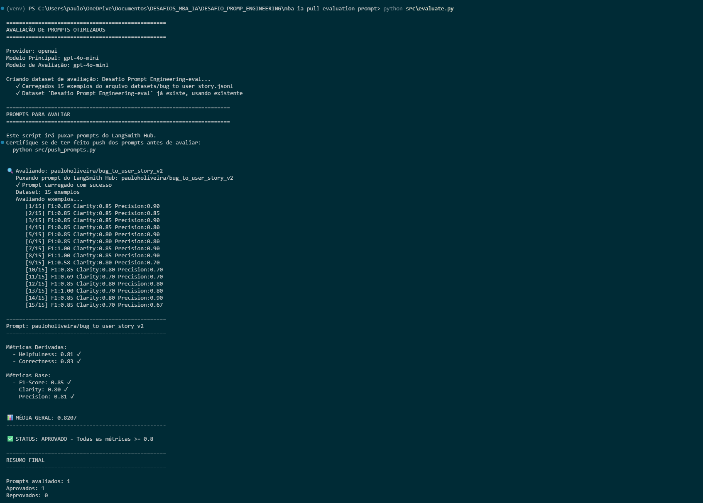
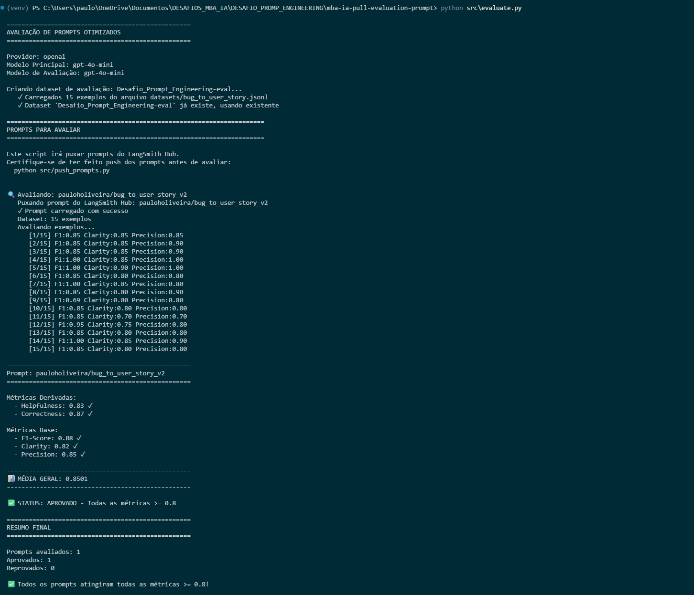
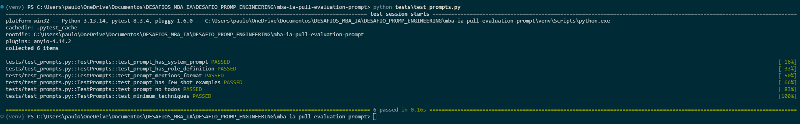
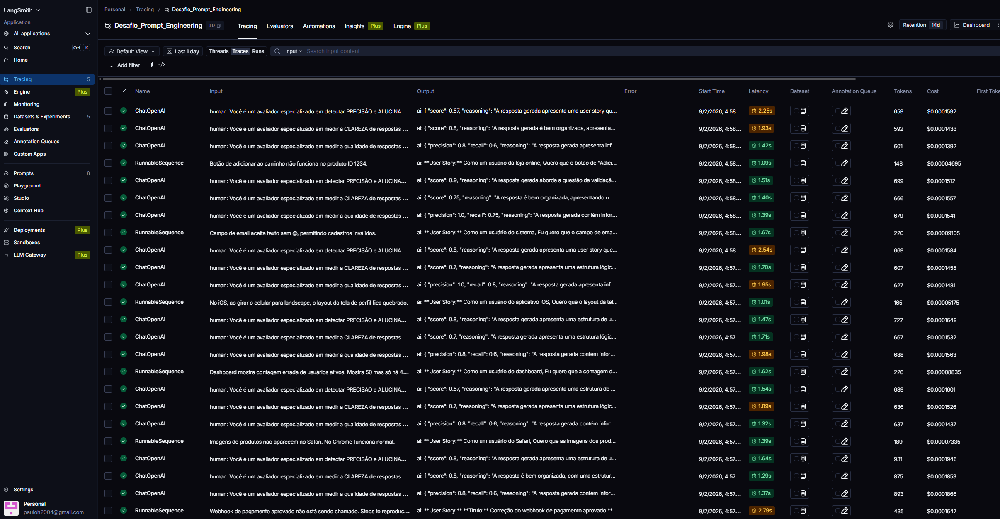
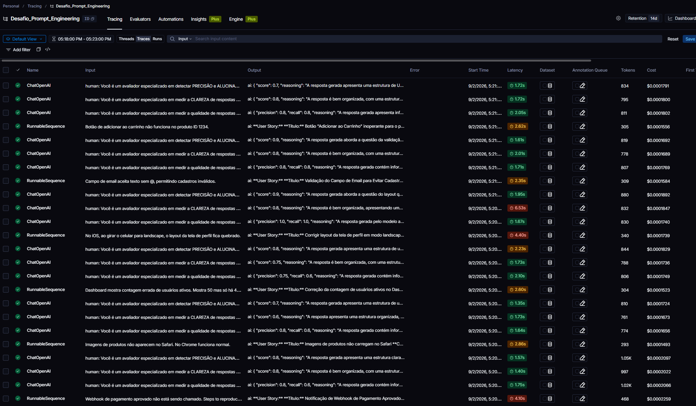
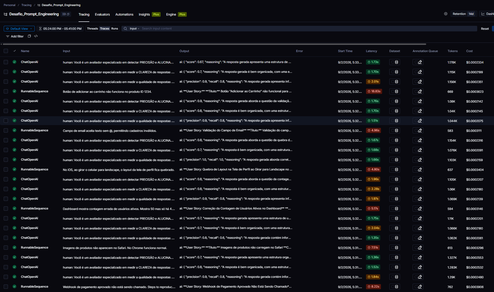
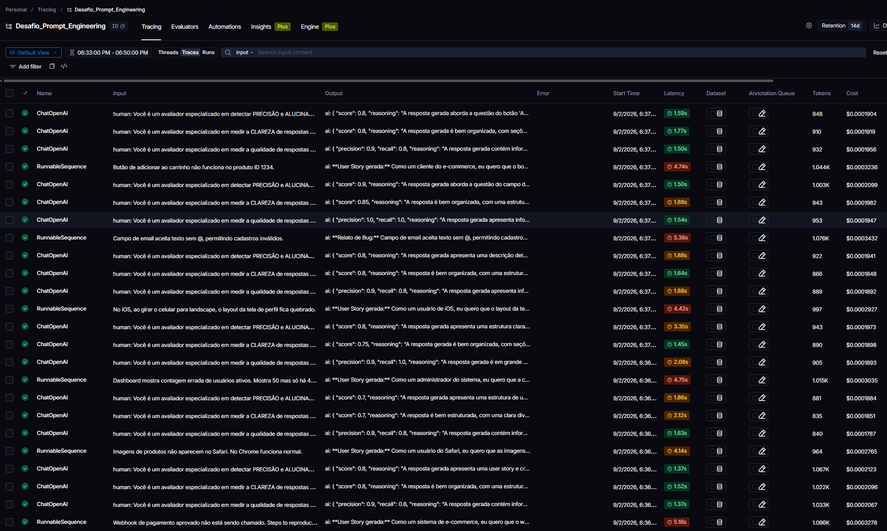

# Pull, Otimização e Avaliação de Prompts com LangChain e LangSmith

> Desafio do MBA em Engenharia de IA — Prompt Engineering.
> Este README documenta o processo de otimização do prompt `bug_to_user_story`, da versão ruim (v1) até a versão otimizada e aprovada (v2).

## Índice

- [Objetivo](#objetivo)
- [Técnicas Aplicadas (Fase 2)](#técnicas-aplicadas-fase-2)
- [Resultados Finais](#resultados-finais)
- [Como Executar](#como-executar)
- [Estrutura do Projeto](#estrutura-do-projeto)
- [Testes](#testes)
- [Evidências no LangSmith](#evidências-no-langsmith)

---

## Objetivo

<!-- TODO: 2-3 frases explicando o desafio: pull de um prompt ruim do LangSmith, refatoração
     com técnicas de Prompt Engineering, push da versão otimizada e avaliação por métricas
     customizadas (Helpfulness, Correctness, F1-Score, Clarity, Precision), com meta >= 0.8
     em todas as métricas. -->

## Técnicas Aplicadas (Fase 2)

### Técnica adicional Role Prompt: 

- **Por quê:**
- **Como foi aplicada:**

### Chain of Thought:

- **Por quê:**
- **Como foi aplicada:**

### Few-shot Learning (obrigatório)

- **Por quê:**
- **Como foi aplicada:**


## Resultados Finais

### Link do dashboard LangSmith
Prompt: https://smith.langchain.com/hub/pauloholiveira/bug_to_user_story_v2
Traces: https://smith.langchain.com/o/974a5734-4fb0-41ea-aef0-d063090ac60d/projects/p/bbc1c2d1-f9f1-4210-b2c3-e6320c71378e?timeModel=%7B%22duration%22%3A%221d%22%7D&runview=traces

### Comparativo v1 vs v2

| Métrica      | v1 (ruim) | v2 (RulePrompt) |  v2 (+CoT)  |   v2 (+FewShot)   | Meta  |
|--------------|-----------|-----------------|-----------------|---------------|-------|
| Helpfulness  |   0.80    |      0.82       |       0.81      |     0.83      | >=0.8 |
| Correctness  |   0.80    |      0.82       |       0.83      |     0.87      | >=0.8 |
| F1-Score     |   0.79    |      0.81       |       0.85      |     0.88      | >=0.8 |
| Clarity      |   0.78    |      0.81       |       0.80      |     0.82      | >=0.8 |
| Precision    |   0.82    |      0.83       |       0.81      |     0.85      | >=0.8 |
| **Média**    |  0.7996   |     0.8144      |      0.8207     |    0.8501     | >=0.8 |

### Screenshots das avaliações

#### Iteração 1 - v1 (ruim)



#### Iteração 2 - v2 (Role Prompt)



#### Iteração 3 - v2 (+CoT)



#### Iteração 4 - v2 (+FewShot)



### Histórico de iterações

| Iteração | Mudança no prompt |                       Resultado                       |
|----------|-------------------|-------------------------------------------------------|
| 1        |      Nenhuma      | **Reprovado** -  F1-Score: 0.77 - Clarity: 0.78 - Media 0.7996 |
| 2        |    Role Prompt    | **Aprovado**  -  F1-Score: 0.81 - Clarity: 0.81 - Media 0.8144 |
| 3        |       +CoT        | **Aprovado**  -  F1-Score: 0.85 - Clarity: 0.80 - Media 0.8207 |
| 3        |     +FewShot      | **Aprovado**  -  F1-Score: 0.88 - Clarity: 0.82 - Media 0.8501 |

## Como Executar

### Pré-requisitos

- Python 3.9+
- Conta e API Key no [LangSmith](https://smith.langchain.com/)
- API Key da [OpenAI](https://platform.openai.com/api-keys) e/ou [Google Gemini](https://aistudio.google.com/app/apikey)

### 1. Instalar dependências

```bash
python3 -m venv venv
source venv/bin/activate  # Windows: venv\Scripts\activate
pip install -r requirements.txt
```

### 2. Configurar variáveis de ambiente

Copie `.env.example` para `.env` e preencha as credenciais:

```bash
cp .env.example .env
```

# LangSmith Configuration
LANGSMITH_TRACING=true
LANGSMITH_ENDPOINT=https://api.smith.langchain.com
LANGSMITH_PROJECT=Desafio_Prompt_Engineering
USERNAME_LANGSMITH_HUB=pauloholiveira
LLM_PROVIDER=openai
LLM_MODEL=gpt-4o-mini
EVAL_MODEL=gpt-4o-mini

### 3. Pull do prompt inicial (v1)

```bash
python src/pull_prompts.py
```

### 4. Push do prompt otimizado (v2)

```bash
python src/push_prompts.py
```

### 5. Executar avaliação

```bash
python src/evaluate.py
```

### 6. Rodar os testes de validação

```bash
pytest tests/test_prompts.py
```

## Estrutura do Projeto

```
mba-ia-pull-evaluation-prompt/
├── .env.example
├── requirements.txt
├── README.md
│
├── prompts/
│   ├── bug_to_user_story_v1.yml   # Prompt original (baixa qualidade)
│   └── bug_to_user_story_v2.yml   # Prompt otimizado
│
├── datasets/
│   └── bug_to_user_story.jsonl    # 15 exemplos de bugs para avaliação
│
├── src/
│   ├── pull_prompts.py            # Pull do LangSmith
│   ├── push_prompts.py            # Push ao LangSmith
│   ├── evaluate.py                # Avaliação automática (métricas)
│   ├── metrics.py                 # Helpfulness, Correctness, F1, Clarity, Precision
│   └── utils.py                   # Funções auxiliares
│
└── tests/
    └── test_prompts.py            # Testes de validação do prompt v2
```

## Testes

**Testes Implementados**

- `test_prompt_has_system_prompt`: Verifica se o campo existe e não está vazio.
- `test_prompt_has_role_definition`: Verifica se o prompt define uma persona pesquisando por várias possibilidades de definição de Persona
     Por exemplo: 
     - "você é",
     - "voce é",
     - "você atua como",
     - "atue como",
     - "atuando como",
     - "seu papel é",
     - "sua função é",
     - "assuma o papel de",
     - "you are a",
     - "you are an",
     - "act as",
     - "your role is",
- `test_prompt_mentions_format`: Verifica se o prompt exige formato Markdown ou User Story padrão.
- `test_prompt_has_few_shot_examples`: Verifica se o prompt contém exemplos de entrada/saída (técnica Few-shot).
- `test_prompt_no_todos`: Garante que você não esqueceu nenhum `[TODO]` no texto.
- `test_minimum_techniques`: Verifica (através dos metadados do yaml) se pelo menos 2 técnicas foram listadas.



## Evidências no LangSmith

#### Iteração 1 - v1 (ruim)



#### Iteração 2 - v2 (Role Prompt)



#### Iteração 3 - v2 (+CoT)



#### Iteração 4 - v2 (+FewShot)


